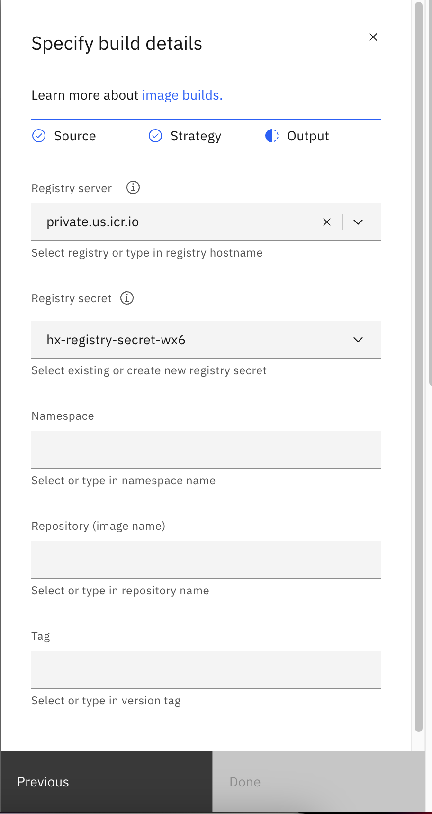

# Background: 
IBM Cloud Code Engine is a fully managed, serverless platform. [Bring your container images, batch jobs, source code or function together in one place and let IBM Cloud Code Engine manage and help secure the underlying infrastructure.](https://www.ibm.com/products/code-engine#:~:text=IBM%20Cloud%C2%AE%20Code%20Engine%20is%20a%20fully%20managed%2C%20serverless,or%20scale%20container%20clusters%20yourself.)

- [Documentation](https://cloud.ibm.com/containers/serverless/overview)
# Overview: 
This repository can be used as an example to deploy applications on Code Engine.

    Contents:
    1. Reserve Code Engine, IBM Cloud Container Registry
    2. Set up Registry secret
    3. Set up GitHub SSH secret
    4. Application Development
    5. Build image, Deploy application
    6. Troubleshooting 

# Reserve Code Engine, IBM Cloud Container Registry
- We need Code Engine, which takes care of all the cluster management, including provisioning, configuring, scaling, and managing servers so you do not need to worry about the underlying infrastructure.
- We also need IBM Cloud Container Registry, which will store our built images. (Alternatives include quay, GitHub Container Registry, ...)
### Techzone Reservations
- For IBMers, make environment reservations via TechZone. 

# Set up Registry secret
1. Go to reserved Techzone environment, navigate to "Manage" > Access (IAM), and create an API key. 
2. Go to Code Engine GUI, select a project. Then navigate to "Secrets and configmap", select "Registry secret" 
3. Select the right location, then paste in created API key


# Set up GitHub SSH secret
1. Create a github repository
2. In local terminal, run: 
`ssh-keygen -t ed25519`
3. DO NOT enter a passphrase (leave empty), complete rest of questions
4. Locate the generated `id_ed25519` and `id_ed25519.pub` files
5. Navigate to GitHub repository > Settings > Deploy keys, and paste in the contents from `id_ed25519.pub` 
6. Go to Code Engine GUI, select a project. Then navigate to "Secrets and configmap", select "SSH secret" 
7. Paste in key from file `id_ed25519`


# Application Development
1. Start development environment
```bash
python3 -m venv .venv
source .venv/bin/activate
pip install -r requirements.txt
```
2. For local development
```
python3 app.py
```
3. Dockerfile will be used to build application by Code Engine
4. If new dependencies are used, update requirements.txt
```
pip freeze > requirements.txt
```

# Build image, deploy application
1. Create an application in Code Engine, and specify build details: 

2. Copy and paste SSH path to Code Repo URL

3. Select SSH secret created in previous step
4. Specify the output of the built image. Select Registry secret created in previous step

5. If namespace is not prepopulated, specify it to be the location of your container registry

6. For repostiroy name, type a new one if
building for the first time

# Troubleshooting:
#### 1. Encountering 403 errors when pushing the screenshots/image in Code Engine
This is likely due to Container Registry running out of space. If you have permission, increase quota of Container Registry.